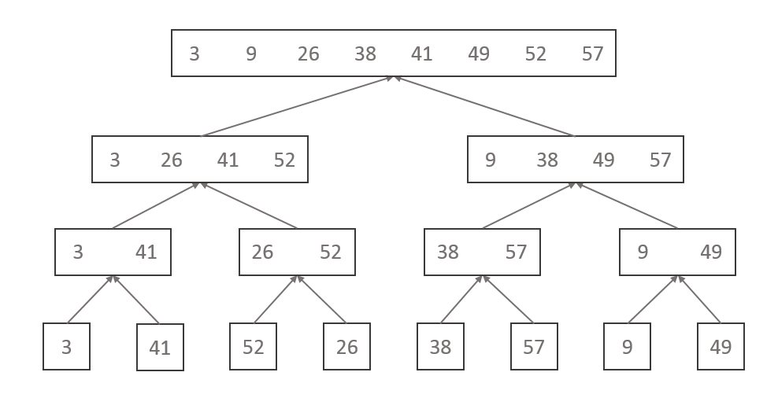

#### 2.3-1
Using Figure 2.4 as a model, illustrate the operation of merge sort on the array
$A=\langle3, 41, 52,26, 38, 57, 9, 49\rangle$.

2.3-2
Rewrite the MERGE procedure so that it does not use sentinels, instead stopping
once either array L or R has had all its elements copied back to A and then copying
the remainder of the other array back into A.